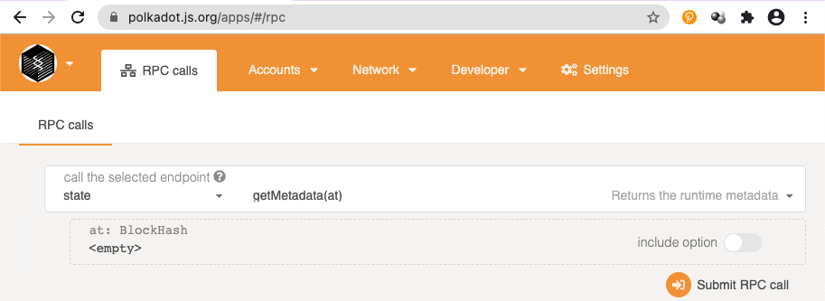
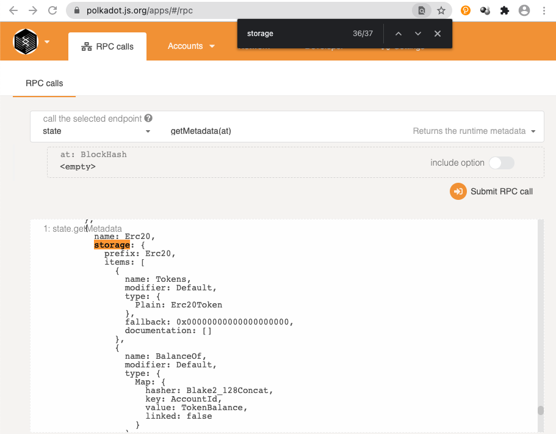
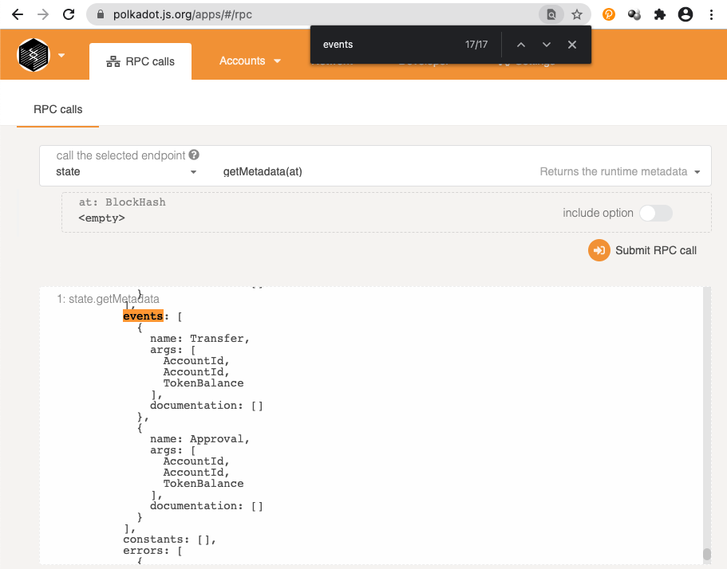
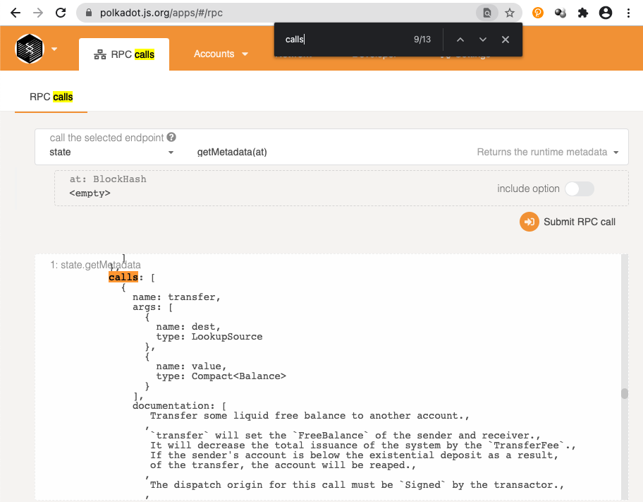
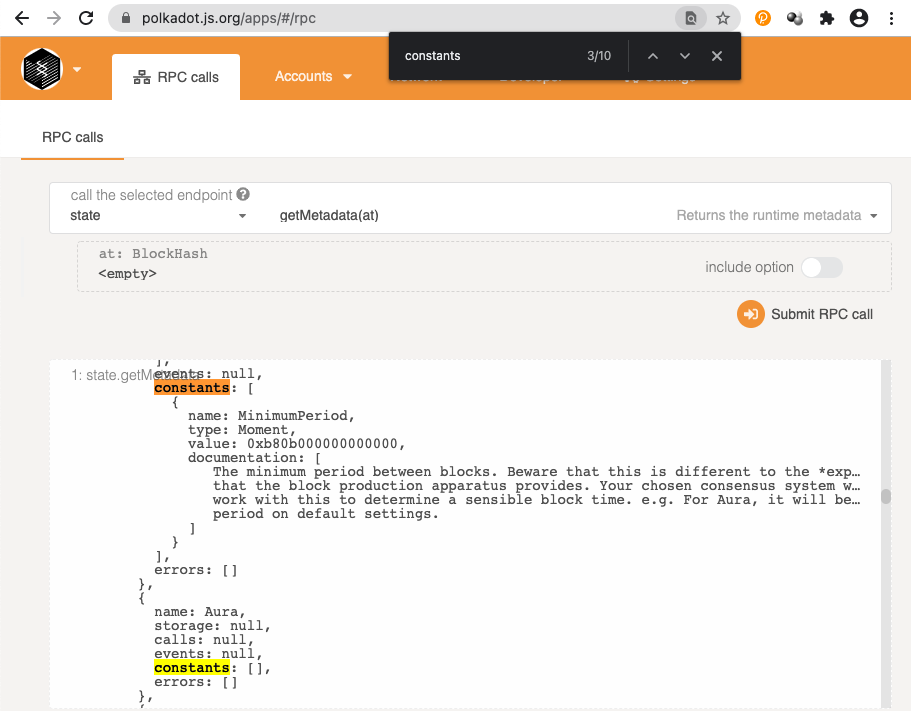
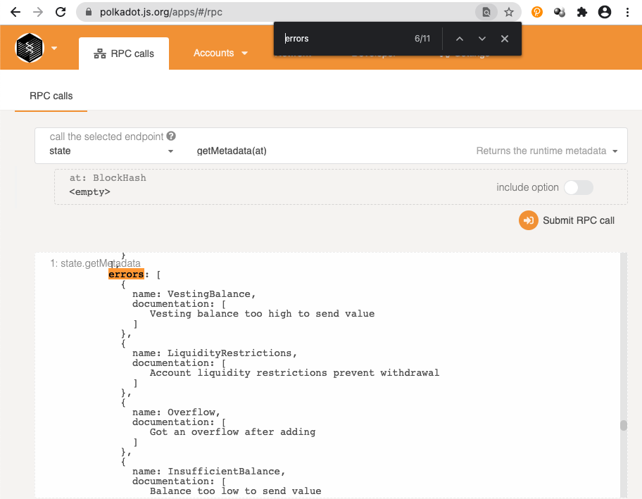

# Metadata 元数据介绍
* Metadata 包含了一个 Runtime 里面所有模块的信息
* polkadot.js SDK 和 polkadot apps 可以通过 Metadata 了解这个runtime
    * 可以自动生成相对应的方法或页面
* RPC state_getMetadata
* 使用 SCALE 编码
* 其中包含了每个模块的元数据
    * 通过 polkadot.js 查看（developer, RPC calls, state, getMetadata） 
    * Storage 
    * Events 
    * Calls 
    * Constants 
    * Errors 
* https://github.com/paritytech/substrate/blob/master/frame/metadata/src/lib.rs
```Rust
pub struct ModuleMetadata {
    pub name: DecodeDifferentStr,
    pub storage: Option<DecodeDifferent<FnEncode<StorageMetadata>, StorageMetadata>>,
    pub calls: ODFnA<FunctionMetadata>,
    pub event: ODFnA<EventMetadata>,
    pub constants: DFnA<ModuleConstantMetadata>,
    pub errors: DFnA<ErrorMetadata>,
}
```

