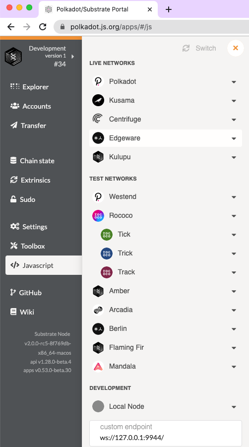

# Substrate 简介
## Substrate 官方文档
* 问：Substrate 官方文档网址是什么？
  * 答：https://substrate.dev/docs

* 问：Substrate 的 recipe 网址是什么？
  * 答：https://substrate.dev/recipes

* 问：Substrate 的 rust docs 的网址是什么？
  * 答：https://substrate.dev/rustdocs

* 问：Substrate 的 tutorial 的网址是什么？
  * 答：https://substrate.dev/en/tutorials

* 问：Substrate Seminar 在每周几进行？
  * 答：每周二 14:00UTC，即北京时间每周二 22:00

## Substrate 和 Polkadot 开源代码仓库
* 问：star 和 watch substrate 仓库
  * 答：https://github.com/paritytech/substrate
  * 

* 问：star 和 watch Polkadot 仓库
  * 答：https://github.com/paritytech/polkadot
  * 

## 编译 substrate-node-template
* 问：编译有哪些步骤？
  * 答：https://substrate.dev/docs/en/tutorials/create-your-first-substrate-chain/setup
  * 第一步：克隆 Substrate Node Template (version v2.0.0-rc5)
    * `git clone -b v2.0.0-rc5 --depth 1 https://github.com/substrate-developer-hub/substrate-node-template`
    * 
  * 第二步：初始化 WebAssembly 的编译环境
    * `source ~/.cargo/env`
    * `rustup update nightly`
    * 
    * `rustup update stable`
    * 
    * `rustup target add wasm32-unknown-unknown --toolchain nightly`
    * 
  * 第三步：创建一个分支，初次编译 substrate-node-template
    * `cd substrate-node-template/`
    * `git checkout -b my-first-substrate-chain`
    * `cargo build --release`
    * 
    * 

## 运行 substrate-node-template
* 问：运行节点并和前端互动编译哪些步骤？
  * 答：https://substrate.dev/docs/en/tutorials/create-your-first-substrate-chain/interact
  * 第一步：开始运行节点
    * `./target/release/node-template purge-chain --dev`
    * `./target/release/node-template --dev`
    * 
  * 第二步：用 polkadot.js 互动
    * 在浏览器打开 https://polkadot.js.org/apps，并在弹窗授权连接
    * 
    * 选择连接本地节点 Local Node
    * 
    * 

